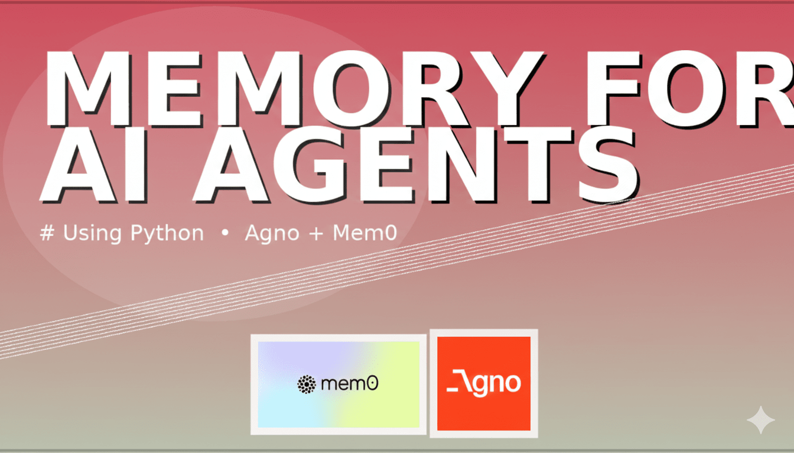

# Agent Memory: Corporate Finance Assistant

## 📱 YouTube Demo



[Watch Demo Video](https://youtube.com/your-video-link)


## Overview

AI-powered corporate finance assistant with persistent memory. Built with [Agno](https://agno.com), [Mem0](https://mem0.ai) for memory management, Google Gemini model, and ChromaDB vector store. Features a Streamlit chat UI.

## Features
- Persistent memory for budgets, variances, and finance data
- Gemini LLM integration (embedding + chat)
- Memory tools for add/retrieve/update operations
- Streamlit web interface
- Demo script for quick testing

## 🚀 Quick Start
> Use python version `3.12.9`
1. **Setup**:
   * Clone Repository
   * `pip install uv` 
   * Create Virtual Environment `uv venv` and activate virtual evironment `.venv\Scripts\activate`
   * Install Dependencies `uv sync`

2. **Set API key**:
   Create `.env`:
   ```
   GOOGLE_API_KEY=your_key_here
   ```

3. **Run Streamlit app**:
   ```bash
   streamlit run app.py
   ```

4. **Test demo**:
   ```bash
   python demo.py
   ```

## Usage Examples
- "Remember Q4 budget: Marketing $2M, R&D $5M"
- "What is Q4 Total Budget Variance Limit?"

## Dependencies
See `pyproject.toml`.

## License
MIT
